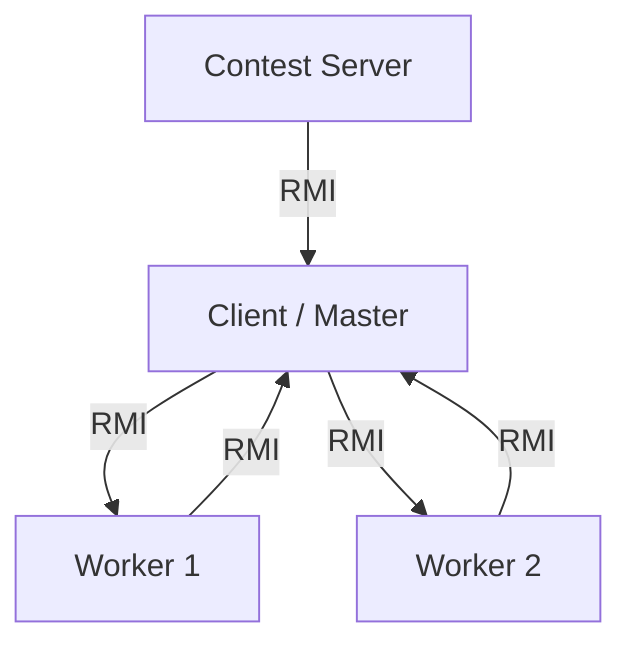

# Project Documentation

## Strategies for Problem Subdivision

The project implements a **distributed brute-force password cracking system** using a Master-Worker architecture. The problem (finding a numeric string that matches a given MD5 hash) is subdivided as follows:

1.  **Server to Client**: The Contest Server provides the md5 hash and a `problemSize` (an upper bound on the number) to the registered Client (Team).
2.  **Client (Master) to Workers**: The Client, acting as a Master for its workers, calculates the total search range `[0, problemSize]`. It divides this range effectively equally (chunks) among the currently connected Workers.
    *   `chunkSize = totalRange / numWorkers`
    *   Each worker is assigned a specific range `[start, end]`.
3.  **Worker Internal**: Inside each Worker node, the assigned range is further subdivided to utilize all available CPU cores.
    *   `threads = availableProcessors`
    *   Each thread is responsible for a sub-segment of the worker's range.

This hierarchical decomposition allows the system to scale with the number of machines (Workers) and the number of cores per machine.

## Communication with Machines

The system uses **Java RMI (Remote Method Invocation)** for all network communication between the components.

### Interfaces
*   **`ServerCommInterface`**:
    *   Used by the **Client** to register with the **Server**.
    *   Used by the **Server** to callback the Client (`publishProblem`).
    *   Used by the **Client** to `submitSolution` back to the Server.
*   **`MasterRepInterface`**:
    *   Used by the **Workers** to register with the **Client** (Master).
    *   Used by the **Workers** to submit a found solution (`submitInternalSolution`).
*   **`WorkerCommInterface`**:
    *   Used by the **Client** to instruct Workers to `solve` a specific range.
    *   Used by the **Client** to `stop` workers once a solution is found.

### Architecture Topology


## Walkthrough

### 1. Compilation
Ensure you have a JDK installed.
```bash
nix-shell -p jdk --run "./compile.sh"
# Or manually:
# mkdir -p bin
# javac -d bin -sourcepath src src/server/*.java src/client/*.java src/worker/*.java src/common/*.java
```

### 2. Start the Server (Mock)
The server mimics the contest environment.
```bash
java -cp bin server.MockServer
```
*It waits for commands.*

### 3. Start the Client
The client connects to the server and listens for workers.
```bash
# Usage: java -cp bin client.CrackerClient <server-host>
java -cp bin client.CrackerClient localhost
```

### 4. Start Worker(s)
Start one or more workers. They connect to the Client (Master).
```bash
# Usage: java -cp bin worker.WorkerNode <master-host>
java -cp bin worker.WorkerNode localhost
```

### 5. Publish a Problem
In the **Server** terminal, type:
```text
publish 12345
```
*   The Server calculates the MD5 of "12345".
*   Sends it to the Client.
*   Client distributes ranges to Worker(s).
*   Worker(s) search.
*   Worker finds "12345", reports to Client.
*   Client reports to Server.
*   Server prints: `!!! SOLUTION SUBMITTED by Wi-Fighters: 12345 !!!`
